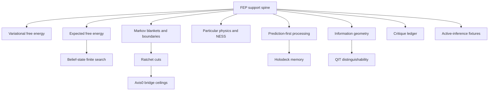

# FEP Research Atlas and Crosswalk

FEP is not a single doctrine page in this wiki. It is a routing spine connecting prediction-first processing, active inference, boundary/blanket theory, viability, autopoiesis, information geometry, distinguishability, and finite search - with every connection fenced by claim ceiling and required local evidence.

The strongest synthesis is not that Codex Ratchet is active inference. FEP matters here because it supplies mature language for systems that persist by maintaining bounded distinctions across a boundary while updating internal states and action policies under uncertainty. Codex Ratchet's stricter local version is finite, probe-relative, noncommutative, and claim-ceiling governed: prediction enters as candidate; constraint pressure kills or preserves; the graveyard maps the boundary; re-entry forms the next belief/candidate cycle.

## Doctrine spine

```text
FEP is a support spine.
Viability is the survival spine.
Distinguishability is the local formal spine.
Holodeck is the memory/world-model spine.
QIT is the carrier/readout spine.
Axis0 is the open bridge spine.
The ratchet is the admission spine.
```

## Routing diagram



## Page map

| Page | Role | Claim ceiling |
|---|---|---|
| [[variational-free-energy-core]] | Formal FEP quantities and decompositions | external formal support only |
| [[expected-free-energy-policy-selection]] | Active-inference policy selection | analogy for finite probe choice, not ratchet objective |
| [[belief-state-tree-search-and-finite-horizons]] | Sophisticated inference and finite belief-state search | finite-horizon analogy, not complete search of `M(C)` |
| [[markov-blankets-boundaries-and-ratchet-cuts]] | Boundary/blanket theory and cut language | Markov blanket is not Axis0 cut |
| [[fep-particular-physics-and-ness]] | NESS, particular partitions, and thingness | support for boundary language, not physics closure |
| [[prediction-first-processing-and-holodeck-memory]] | Predictive processing and memory/world-model routing | support for holodeck reading, not consciousness proof |
| [[fep-viability-and-ratchet-survival]] | Viability theory as safer survival spine | survival framing, not FEP proof |
| [[fep-autopoiesis-enactivism-and-sense-making]] | Autopoiesis/enactivism neighbor concepts | conceptual support, not implementation proof |
| [[fep-information-geometry-and-gradient-flow]] | Fisher/natural-gradient/flow language | geometry support, not QIT carrier admission |
| [[fep-distinguishability-and-operational-identity]] | Distinguishability and operational identity bridge | formal analogy, not owner-system derivation |
| [[fep-critique-and-assumption-ledger]] | Critiques and required assumptions | overclaim blocker |
| [[fep-to-axis0-bridge-claim-ceilings]] | Axis0 bridge ceilings and banned collapses | Axis0 remains open |
| [[active-inference-benchmark-fixtures]] | Future toy fixtures | future sim ideas only |
| [[fep-glossary]] | Terms used across the atlas | vocabulary support |

## Banned collapses

Do not write or imply:

- `FEP = Codex Ratchet`
- `Markov blanket = Axis0 cut`
- `expected free energy = ratchet objective`
- `active inference = Leviathan implementation`
- `prediction-first = consciousness proof`
- `particular physics = gravity solved`

## Safe use

Use FEP pages to:

- name existing external concepts precisely;
- compare prediction-first, viability, boundary, and information-geometric language;
- propose finite fixtures and falsifiers;
- route analogy through claim ceilings before it touches repo doctrine.

Do not use FEP pages to:

- promote a Codex Ratchet sim, bridge, Axis0, or QIT engine claim without local receipt evidence;
- turn active-inference planning into teleological ratchet doctrine;
- make Leviathan OS implementation claims without current repo evidence;
- smooth over Biehl/Pollock/Kanai or Aguilera/Millidge/Tschantz/Buckley critiques.

## Source anchors

- Friston's "particular physics" source is useful for Markov blankets, nonequilibrium steady state, recursive composition, and statistical distinguishability.
- "Sophisticated Inference" and "Reward Maximisation through Discrete Active Inference" are useful for recursive belief-state planning and finite-horizon active inference caveats.
- "The free energy principle made simpler but not too simple" is useful as a compact route through random dynamical systems, particular partitions, inference, and least-action framing.
- "Neural dynamics under active inference" is useful for prediction error, natural-gradient, information-length, and metabolic-efficiency language.
- Harper's information-geometry/game-theory source is useful for Fisher metric and Shahshahani/simplex geometry neighbor language.
- Biehl/Pollock/Kanai and Aguilera/Millidge/Tschantz/Buckley are mandatory critique anchors before broad FEP claims.
- Viability theory is safer for survival-under-constraints language than unrestricted FEP metaphysics.

## Bounded intake pack

```yaml
purpose: Make FEP a routed external-support atlas instead of one overloaded doctrine page.
role: wiki_router
frame: FEP support spine with viability, distinguishability, holodeck, QIT, Axis0, critique, and benchmark leaves.
read_order:
  - concepts/fep-research-atlas-and-crosswalk.md
  - concepts/fep-and-active-inference-reference.md
  - concepts/sophisticated-inference-active-inference.md
  - concepts/holodeck-qit-fep-leviathan-integration.md
required_boundaries:
  - no FEP = Codex Ratchet collapse
  - no Markov blanket = Axis0 cut collapse
  - no active inference = Leviathan implementation collapse
  - no prediction-first = consciousness proof collapse
  - no particular physics = gravity solved collapse
promotion_rule: Every stronger local claim requires repo evidence, result artifact, or explicit blocked-reason receipt.
```
