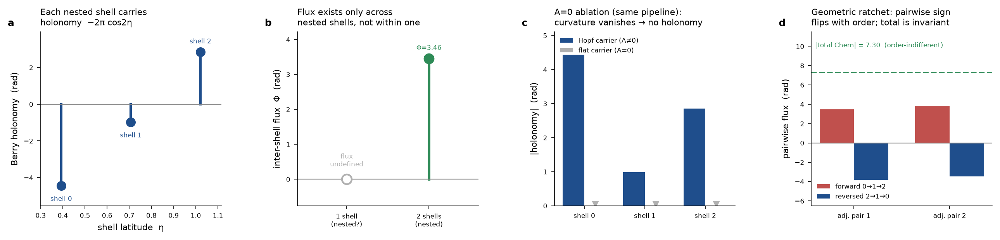
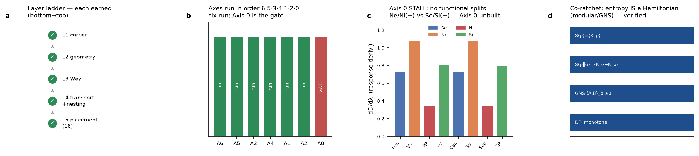
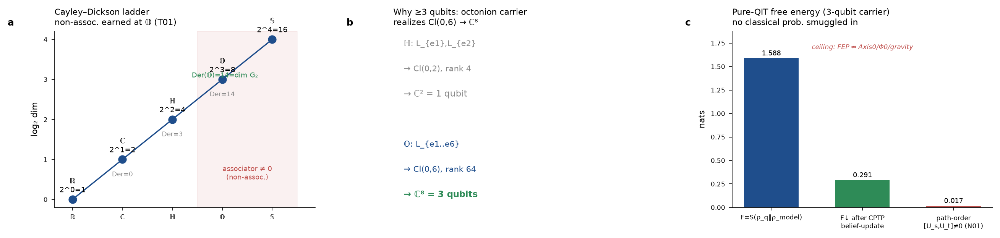
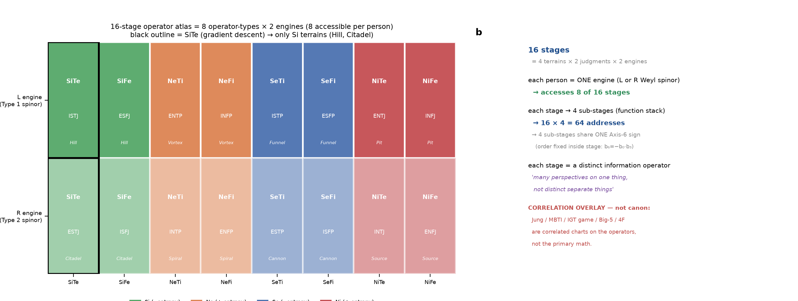
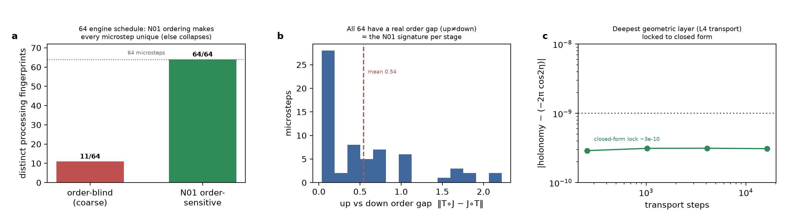
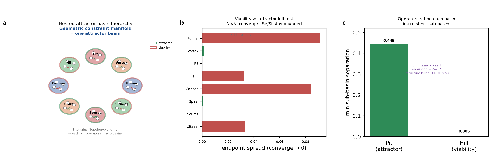
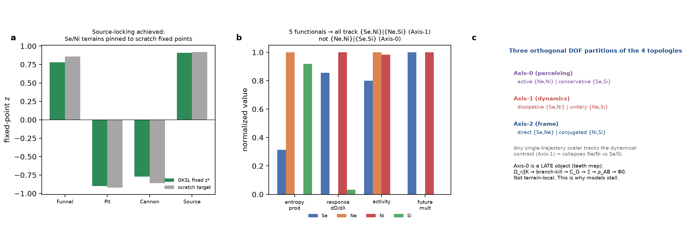
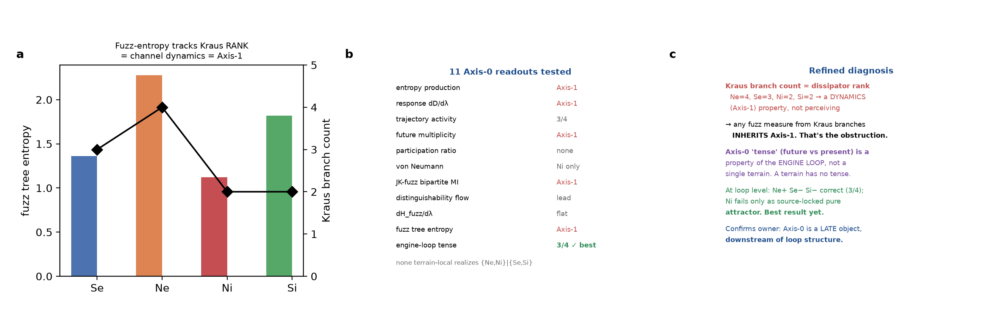

# The Geometric Constraint Manifold — Consolidated Reader's Guide

This document consolidates the geometric-constraint-manifold arc (spec sections 7 through 7k)
into one narrative: what was built, in what order, what each layer earned, and where the honest
open edges are. Everything here is `scratch_diagnostic` — exploration that feeds the owner's
ratchet, not admitted canon.

## The through-line

The manifold is built **layer by layer, each earned before the next**, then the **axes are run**
on top (order 6·5·3·4·1·2·0). Recurring discipline: read the owner's real math from the repo,
implement it exactly, gate it (CPTP / Choi / symbolic), test the owner's claim, report honestly —
never invent structure to force a result. Two rules dominate: **DOFs must not collapse** (the axes
are genuine degrees of freedom, not labels) and **claim-grade discipline** (float tolerance is
diagnostic, never promotable).

## Layer 1 — Carrier, geometry, Weyl sheets (S4-S6)

Finite realization: carrier C^2, density ball, exact Pauli basis, the Hopf chart psi_s(phi,chi;eta),
and the two **Weyl sheets** H_L=+H0, H_R=-H0 with Bloch laws r_L'=+2n x r_L, r_R'=-2n x r_R. Eight
terrain generators in GKSL form, one per (topology x sheet). Audited: sigma_pm exact, Weyl laws
exact to ~2e-16, b6 = -b0.b3 exhaustive 0/8, all 8 generators valid CPTP semigroups.

## Layer 2 — The geometric ratchet: nested flux (S7a)

Flux is **not** primitive. A single Hopf shell gives only holonomy (contour A = -2pi cos2eta);
**flux requires nesting** — Phi(eta_i,eta_j)=2pi(cos2eta_i - cos2eta_j) between shells. The
geometric ratchet: pairwise fluxes are **order-sensitive** (forward [3.46,3.84], reversed
[-3.84,-3.46]), total Chern **order-indifferent** (|Phi|=7.295). Hardening item #1 closed: a real
A=0 flat carrier through the transport pipeline gives holonomy identically 0 (not a hand-authored
dict). The 720deg = 2x360deg SU(2) double cover carries two independent Weyl engines with
deductive/inductive swapped inner-vs-outer.

## Layer 3 — The co-ratchet: entropy and operators (S7b-S7c)

Entropy and operators must be earned too, and they **run on the manifold**. The math home is the
**GNS construction** (a state reconstructs its Hilbert space) plus **Tomita-Takesaki modular
theory** (a state generates its own modular Hamiltonian K_rho = -log rho; relative entropy =
modular free energy — "entropy IS a Hamiltonian," the owner's "seen as one"). Four modular
identities verified exactly: S(rho)=<K_rho>, S(rho||sigma)=<K_sigma - K_rho> >= 0, GNS Gram PSD,
data-processing monotone.

## Layer 4 — The three-qubit floor: octonions, Cl(0,6), G2, pure-QIT FEP (S7d-S7e)

At least **3 qubits** are needed for many things to run. Verified: octonion left multiplications
generate **Cl(0,6)** (rank 64, spinor dim 8 = 3 qubits); associator max-norm H=0, O=2 (witness
(1,2,4)); dim Der(R,C,H,O)=0,0,3,14 (14 = dim **G2**). Non-associativity is **root-native but
rung-later** — routed to the octonion carrier lane, not promoted to an R1/R2 root constraint.
Pure-QIT FEP (no smuggled classical math): variational free energy as Umegaki relative entropy,
decreasing under a CPTP belief update, with the explicit claim ceiling that FEP **cannot** close
Axis-0/Phi0/gravity/consciousness.

## Layer 5 — The 16-stage atlas and the 64-microstep engine (S7f-S7g)

**16 stages = 8 operator-types x 2 engines**; each person is ONE engine (left/right Weyl spinor)
and accesses **8 of 16**. Gradient descent = **SiTe**, landing on exactly the 2 Si terrains (Hill,
Citadel) — matching the owner's hand-derived expectation. The **64 schedule = 2 engines x 8
terrains x 4 operators**. The four judging operators are exact channels on M2(C): **Ti/Te** =
z/x-dephasing (unital CPTP), **Fi/Fe** = x/z-rotation (reversible). Signed: **up = operator-first**,
**down = terrain-first**; SiTe = Te-down = gradient descent. Unique-processing result: an
order-blind readout **collapses** (11/64 distinct), the N01 order-sensitive readout **lifts to
64/64** — unique processing is an N01 property of the observable, not of adding terrains. Deepest
layer precision: holonomy vs closed form converged to ~3e-10.

## The nested attractor-basin hierarchy (S7h)

The 2 engines, 4 topologies, flux, and 8 terrains are all structure of **one** geometric constraint
manifold; the co-ratchet couples as **sub-basins**. Against the repo's basin-manifold claim
contract: 8 distinct terrain basins; a **kill test** splits Ne/Ni (attractor, converge) from Se/Si
(viability, bounded) — coinciding with Axis-0 polarity, an independent corroboration. Operators
refine each basin into sub-basins (Pit sep 0.445, Hill 0.005); a **commuting control** kills the
order gap (2e-17) — the structure is genuinely N01-driven.

## The Axis-0 stall — diagnosed from first principles (S7i-S7k)

This is where every prior model got stuck, and the arc's main honest result.

**First, the blocker was closed.** All 8 terrains were **source-locked** to their scratch Bloch-map
fixed points (Se turned out to be *generalized amplitude damping* toward z* approx +-.86, not the
dephasing used earlier). The Se/Ne/Si dissipators are no longer agent-chosen.

**Then, the stall was explained.** Eleven principled Axis-0 readouts were tested — entropy
production, response dD/dlambda, activity, future multiplicity, participation ratio, von Neumann,
JK-fuzz bipartite MI, dH_fuzz/dlambda, fuzz tree-entropy, distinguishability-flow, engine-loop
tense. **None terrain-local realizes the Ne/Ni | Se/Si split.** The reason is structural: the three
DOF partitions are **mutually orthogonal** —

- Axis-0 (perceiving): active {Ne,Ni} | conservative {Se,Si}
- Axis-1 (dynamics): dissipative {Se,Ni} | unitary {Ne,Si}
- Axis-2 (frame): direct {Se,Ne} | conjugated {Ni,Si}

Any single-trajectory scalar tracks the **dynamical** contrast (Axis-1), which cuts across Axis-0 —
so collapse is forced. Even the JK-fuzz field inherits Axis-1, because fuzz branch-multiplicity is
driven by the dissipative/unitary balance.

**A contradiction and a candidate fix.** The owner calls Ni "positive entropy," but Ni (Pit/Source)
has the **lowest state entropy** (converges to a pure pole). So "entropy" in Axis-0 cannot be state
entropy — it must be **fuzz-field entropy** (entropy over the admissible-future distribution).
Axis-0 is the Jungian **intuition vs sensing** axis: many admissible futures vs one actual present.

**The best result: Axis-0 is a loop property, not terrain-local.** At the **engine-loop** level
(deductive UEUE vs inductive EUEU), 3/4 families separate correctly (Ne+, Se-, Si-); only Ni fails,
and only because it is a source-locked pure attractor. This is strong first-principles support for
the owner's doctrine that **Axis-0 is a late object, downstream of loop/engine structure** — exactly
what the teeth map says (Omega_r/JK -> branch-kill -> C_G -> Xi -> rho_AB -> Phi0).

## Honest open edges

1. **Axis-0 is not closed** — but now for a *principled* reason. Next rung: test it at the full
   720deg=2x360deg double-loop, treating Ni as the pure-attractor special case, or as a genuinely
   downstream rho_AB -> Phi_0 readout taken *after* the loop.
2. **Name STATE entropy and FUZZ entropy distinctly** everywhere — one rename resolves the Ni
   contradiction and de-drifts the Axis-0 doc cluster.
3. **Basin-boundary topology** (smooth/fractal/riddled/Wada) and sub-sub-basin depth beyond one
   level: untested.
4. **Run the owner's real engines** (Julia/JAX/PyTorch system_v5/v6 sims). The re-implementations
   here agree with saved Julia to ~1e-12, but the owner's engines are ground truth.

## Where to read the detail

Full math: `constraint-core-formal-spec-2026-07-01.md` sections 7-7k.
Methods/tools/thinking/suggestions: `constraint-core-methods-report-2026-07-01.md`.
Standalone sims: `flux_nesting_ablation_jax.py`, `manifold_build_ladder.py`,
`three_qubit_octonion_fep.py`, `engine_64_schedule_sim.py`, `nested_basin_sim.py`,
`terrain_sourcelock_axis0_sim.py`.
