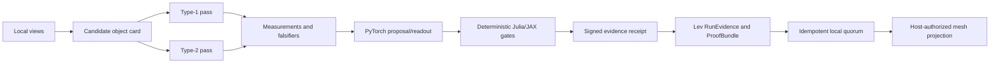

# QIT / Lev Operationalization Plan - 2026-07-09

## Decision

Build the useful system first. Keep the deepest math as a parallel research program.

The current repo is sufficient to attempt a real SME object/evidence runtime. It is not sufficient to claim full QIT perception, 64 intelligences, Axis0, a completed manifold, or physics closure.

Tracked implementation authority:

`/Users/joshuaeisenhart/Codex-Ratchet/system_v5/ops/QIT_LEV_OPERATIONALIZATION_PLAN_20260709.md`

Research digest:

[[projects/codex-ratchet/current-research-frontier-2026-07-09]]

Exact engine-state audit:

[[projects/codex-ratchet/engine-16x4-axis6-current-state-2026-07-09]]

July 9 execution update: the fixed-sign sequential system-ID instrument now
passes locally for both conditional cycle orientations. This closes a bounded
execution rung, not the dual-ratchet emergence or SME usefulness gates. See
[[concepts/sindy-koopman-system-identification-for-qit-engines-2026-07-09]].

Fresh broad harness state is `123/0/0` green, while the regenerated formation
loss is `43.546185436758485`. Treat that as a split result: engine/sim plumbing
runs, but current trajectory-based handling is not good enough for the SME
object rung.

## Product Hypothesis

A blue-collar SME has many local vocabularies for the same thing: technician language, work orders, asset records, parts catalogs, sensor streams, safety rules, contracts, and customer language.

The first useful Leviathan/QIT object is not a universal ontology. It is a locally governed evidence object that can say:

```text
these views probably refer to the same maintenance incident;
these views conflict;
this measurement would resolve the conflict;
this conclusion passed these gates;
these alternatives were rejected for these reasons.
```

That is already a meaningful decentralized Palantir-like primitive for SMEs if provenance, uncertainty, local vocabulary, and host authority stay intact.

## First Pilot

Root candidate:

```text
maintenance incident on asset P-204 at job site J-17
```

Views:

- technician note;
- work order;
- asset registry;
- part/invoice record;
- vibration or temperature summary;
- later, an equipment photo.

The dataset must contain aliases, reused parts, conflicting times, similar assets, missing views, and an unresolved collision. Otherwise the object test is too easy.

## Runtime Shape



The learned layer proposes. It never grants authority to itself.

## Delivery Ladder

### 0. Freeze Current Teeth

- Pin one authority manifest: repo branch, checkout, sources, fixtures, commands, runtimes, seeds, and hashes.
- Name three different objects explicitly: the 16 signed source slots, the
  proxy `8 terrains x 2 selected/native operators` fingerprint set, and the
  proposed 16 x 4 expansion.
- Parse one declared source into exactly 16 macro-stages and 64 proposed
  operator transitions.
- Preserve `four_substages_dual_product_v0` as a passing conditional
  prerequisite: it recovers four source operator cells and one MSS square
  cycle, but it does not establish sequential stage dynamics.
- Reject packet UP-130 as a derivation and keep UP-129 at the terrain-position
  ceiling recorded in
  [[projects/codex-ratchet/packet-97-up129-up130-audit-2026-07-09]].
- Preserve the now-green `stage16x4_system_id_instrument_v0`: both candidate
  orientations run all four exact operators sequentially inside every source
  slot while holding that slot's precedence sign fixed; all local destructive
  controls move the exact held-out transition.
- Build the still-missing emergence packet: start from a larger candidate set
  and let independent geometry-first and entropy-first survivor ratchets emit
  the stage interior without receiving a desired count.
- Keep the current `candidate -> measurement -> gate -> receipt` science phases separate from operator substages until the parser proves they coincide.
- Run the 16-stage re-identification and Type-2 order tests over preregistered multi-seed distributions.
- Add Choi/superoperator fingerprints; reverse, one-beat-removal, duplicate,
  sign-flip, terrain-identity, native-only, and non-native controls; and a
  held-out task where each claimed substage is load-bearing.
- Preserve the pinned PySINDy capability receipt and the narrow PyKoopman
  `Identity + EDMD` receipt. Keep the full PyKoopman distribution quarantined.
- Pass classification, authority-manifest, depth, provenance, and result-shape
  contract lint before promotion.
- Preserve the successful stage-identity result and the current Type-2 failure separately.
- Stop using any engine claim that does not survive the multi-seed null.

Exit: a clean-checkout-reproducible baseline with literal claim ceilings and a corruption control that breaks the schedule.

### 1. Build The SME Object Battery

- Remove all direct object IDs from features.
- Build survivor hashes, anti-hashes, provenance, contradictions, and refusal states.
- Compare against bag-of-fields and ordinary entity-resolution baselines.
- Require held-out views and alias drift.

Exit: an object is recovered because its evidence structure persists, not because its name leaks.

### 2. Distinguish The Two Methods

Run both methods on the same objects and equalize information and compute budgets:

- Type-1 begins from a candidate and tries to confirm or kill it.
- Type-2 begins from a measurement and tries to form and counter-project a candidate.

Require stage-removal, order-erasure, sheet-swap, static-state, and shuffled-context controls.

Also require a closed-loop test: actions must change or select subsequent world observations, and declared regime shifts must be detected within eight ticks at the preregistered false-positive rate. The current fixture-driven belief update does not satisfy this gate.

Exit: each method has a reproducible task family where it uniquely helps, or the two-engine interpretation is demoted.

### 3. Make PyTorch Learning Real

- Seal train/validation/test splits by root object and alias family.
- Train a differentiable readout or graph/message-passing layer.
- Measure calibration, abstention, and held-out improvement.
- Compare with random features, linear bags, majority, and shuffled labels.

Exit: removing the learned layer measurably worsens held-out performance without changing deterministic admission rules.

### 4. Earn Perception

- Bind genuinely unseen views.
- Maintain multiple hypotheses under ambiguity.
- request the next discriminating measurement;
- split or revise an object when counter-evidence arrives;
- retain rejected projections as anti-hash receipts.

Add images only after the structured battery is frozen.

Exit: the system beats a strong entity-resolution baseline and improves a downstream maintenance decision.

### 5. Close The Lev Evidence Boundary

- Convert object receipts into current `RunEvidence`.
- Bind source, trace, gates, claims, and blocked consumers in a `ProofBundle`.
- Prove idempotent double-consumption.
- Enforce `promotion_allowed=false`.
- Prove no graph or mesh mutation before host policy.
- Require k-of-n local verifier quorum.

Exit: a tampered or failed receipt cannot project; a repeated receipt cannot duplicate state.

### 6. Run A Two-Node Mesh Trial

- Give two local nodes different partial views.
- Exchange claims/evidence only.
- Reconcile to convergence, conflict, or insufficient evidence.
- Test partition, replay, and rejoin.

Exit: no hidden shared mutable state, no duplicate object, no silent conflict smoothing.

### 7. Measure SME Value

Compare the system with the current workflow on:

- duplicate incident reduction;
- time to identify the asset/part;
- conflict detection;
- next-inspection quality;
- audit preparation time.

Exit: measurable workflow improvement with expert-correctable provenance. Otherwise the project remains research.

## Hard Kill Gates

Stop or demote the associated claim when:

- full engine features do not beat an SVD/static proxy across seeds;
- Type-1/Type-2 differences disappear under matched budgets;
- the 64 count depends on repeated narrative phases instead of source-derived operator transitions;
- the four independently probed channels do not survive as four sequential,
  same-sign, load-bearing beats;
- actions only update beliefs over a fixed fixture, or declared shifts remain undetected;
- object binding is matched by a bag-of-fields baseline;
- learning depends on alias or split leakage;
- ambiguity is force-fit instead of refused;
- Lev consumes external evidence as direct state mutation;
- mesh convergence depends on hidden shared mutable state;
- the pilot does not improve a real workflow.

## Parallel Research, Not Product Blockers

- Jordan/nonassociative DPI;
- two-dimensional BKM curvature;
- generic Schmidt-orbit holonomy;
- Axis0 and complete manifold admission;
- exceptional-carrier necessity;
- FEP, physics, cosmology, and thermal-time interpretations.

These may strengthen or kill the larger theory. They are not prerequisites for an evidence-governed maintenance object system.

## Honest Answer

The bounded system is possible enough to justify a disciplined build.

The full theory may be right, partly right, or wrong. The plan is designed so useful infrastructure survives even if the deepest interpretation fails, and so failures become receipts instead of being narrated away.
